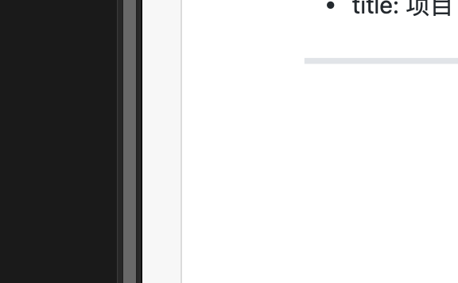
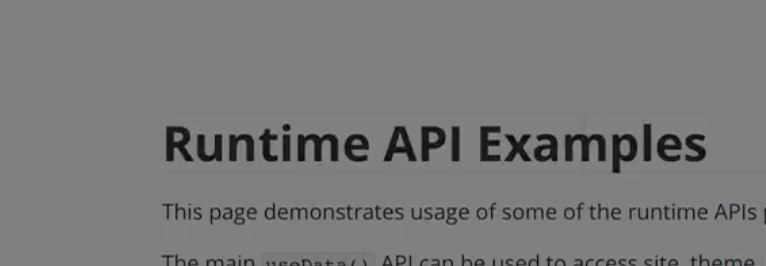

---
# https://vitepress.dev/reference/default-theme-home-page
layout: home

hero:
  name: "MobyTang😼"
  text: "knowledge base"
  tagline: Store knowledge about design and code
  actions:
    - theme: brand
      text: Markdown Examples
      link: ./示例/markdown-examples
    - theme: alt
      text: API Examples
      link: ./示例/markdown-examples

features:
  - title: 项目 A
    details: 简介
    link: ./示例/markdown-examples
  - title: 项目 B
    details: 简介
  - title: 项目 C
    details: 简介
---

